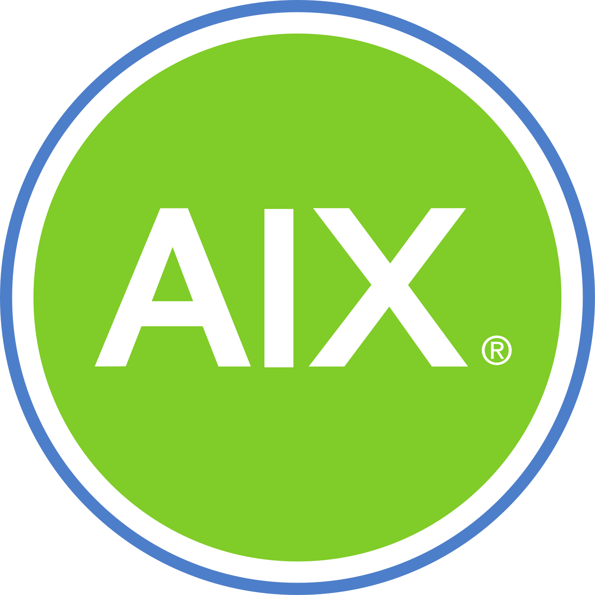

# **Marcio Moreira Junior**

### **Linux SysAdmin** | **IT Infra Specialist** | **DevOps Engineer** | **SRE** | **Cloud Engineer**

 
 
 

## **About Me**

Hi! I am Marcio, and welcome to my code place.

I am a System Administrator, Linux Engineer, and DevOps/SRE specialist with extensive experience in managing complex infrastructures. I
focus on automation (infra as a code), optimizing systems for performance and reliability. Currently, I'm developing the AutoM8 project, developing ansible playbooks , shell and python scripts to make my life easier. My expertise spans containerization, cloud environments, CI/CD pipelines, and scalable solutions.

## **Tech Stack**

### **Automation/IaC**

-  Ansible
-  AWX
-  Chef
-  Puppet
-  Rundeck
-  Semaphore
-  Terraform

### **CI/CD**

-  BitBucket
-  Gitlab
-  Github
-  Gitea
-  Jenkins

### **Cloud Computing**

-  AWS
-  Digital Ocean
-  GCP
-  Openstack
-  Linode
-  Vultr

### **Communication**

-  MailCow
-  SoGO

### **Containers**

-  LXD
-  Docker
-  Podman
-  Portainer
-  Kubernetes

### **Databases**

-  MariaDB
-  MySQL
-  MongoDB
-  PostgreSQL
-  Redis

### **Development**

-  Shell Script
-  Git
-  Go
-  HTML5
-  NodeJS
-  PHP
-  Python

### **Management/Control Panels**

-  CockPit
-  Netbox
-  NextCloud
-  OpenProject
-  SonatypeNexus
-  Virtualmin
-  Webmin

### **Monitoring/Observability**

-  Datadog
-  Elastic Search
-  Fluentd
-  Grafana
-  Icinga
-  Kibana
-  LogStash
-  Nagios
-  Netdata
-  New Relic
-  Prometheus
-  Zabbix

### **Network**

-  Cisco Routers
-  CloudFlare
-  Fortinet Appliances
-  Huawei Routers
-  OpnSense
-  pfSense

### **Operating Systems**

#### Linux

-  ArchLinux
-  CentOS
-  Debian
-  Fedora
-  OpenSUSE
-  Red Hat
-  Rocky Linux
-  Ubuntu

#### Unix

-  AIX
-  FreeBSD
-  NetBSD
-  OpenBSD
-  Oracle Solaris

#### Friendly

-  Microsoft Windows
-  MacOSX

### **Security**

-  BackRest
-  FreeIPA
-  OpenLDAP
-  OpenVAS
-  OpenVPN
-  RClone
-  Restic
-  Sophos
-  VaultWarden
-  Veeam Data Cloud
-  Wazuh
-  WireGuard

### **Storage**

-  Ceph
-  GlusterFS

### **Virtualization**

-  Oracle VirtualBox
-  oVirt
-  Packer
-  Proxmox
-  QEMU
-  Vagrant
-  VMWare ESXi
-  VMWare VCenter
-  VMWare Workstation

## Current Projects

I'm currently working on [**AutoM8**](https://github.com/mdmjunior/AutoM8), a powerful automation tool designed to simplify and streamline repetitive tasks. 
Check it out and feel free to contribute!
