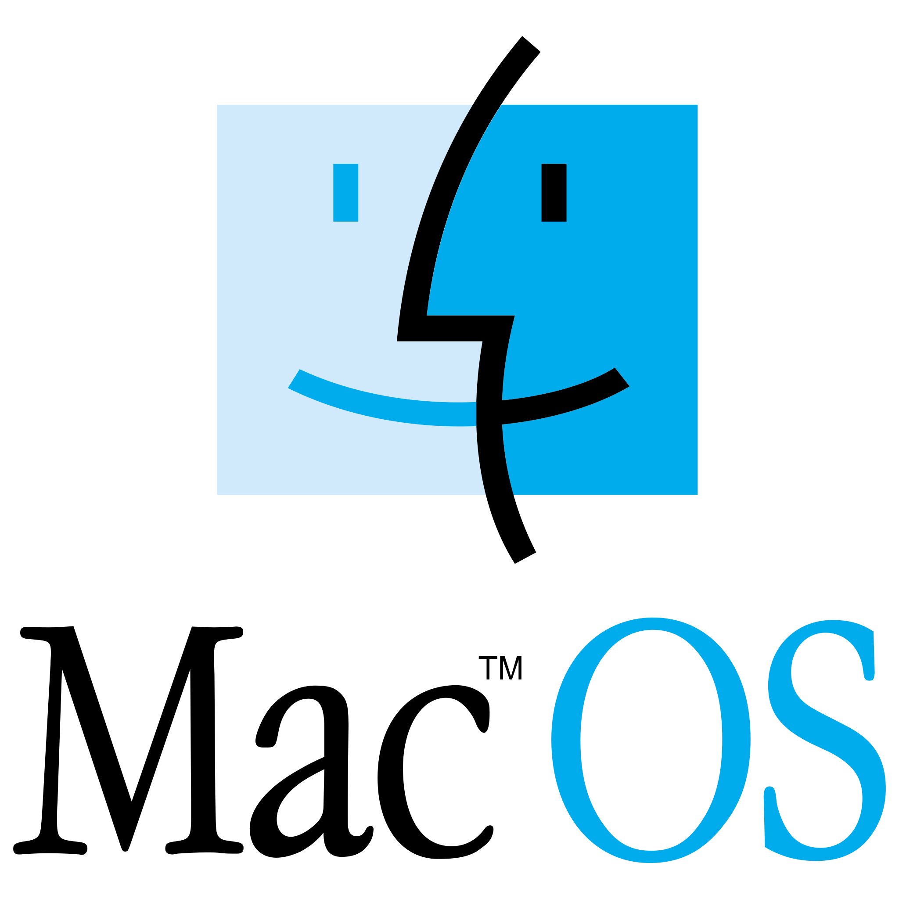

<h2>MY TECH STACK</h2>

<h3>Automation, IaC & DevOps</h3>

<table align="center" role="presentation" border="0" cellpadding="10" cellspacing="0" style="border: 0; border-collapse: collapse; background-color: transparent;">
  <tr style="border: 0; background-color: transparent;">
    <td align="center" width="96" style="border: 0; background-color: transparent;"></td>
    <td align="center" width="96" style="border: 0; background-color: transparent;"></td>
    <td align="center" width="96" style="border: 0; background-color: transparent;"></td>
    <td align="center" width="96" style="border: 0; background-color: transparent;"></td>
    <td align="center" width="96" style="border: 0; background-color: transparent;"></td>
  </tr>
</table>

<h3>Containers & Orchestration</h3>

<table align="center" role="presentation" border="0" cellpadding="10" cellspacing="0" style="border: 0; border-collapse: collapse; background-color: transparent;">
  <tr style="border: 0; background-color: transparent;">
    <td align="center" width="96" style="border: 0; background-color: transparent;"></td>
    <td align="center" width="96" style="border: 0; background-color: transparent;"></td>
    <td align="center" width="96" style="border: 0; background-color: transparent;"></td>
    <td align="center" width="96" style="border: 0; background-color: transparent;"></td>
    <td align="center" width="96" style="border: 0; background-color: transparent;"></td>
  </tr>
</table>

<h3>Cloud, Network & Edge</h3>

<table align="center" role="presentation" border="0" cellpadding="10" cellspacing="0" style="border: 0; border-collapse: collapse; background-color: transparent;">
  <tr style="border: 0; background-color: transparent;">
    <td align="center" width="96" style="border: 0; background-color: transparent;"></td>
    <td align="center" width="96" style="border: 0; background-color: transparent;"></td>
    <td align="center" width="96" style="border: 0; background-color: transparent;"></td>
    <td align="center" width="96" style="border: 0; background-color: transparent;"></td>
  </tr>
</table>

<h3>Observability</h3>

<table align="center" role="presentation" border="0" cellpadding="10" cellspacing="0" style="border: 0; border-collapse: collapse; background-color: transparent;">
  <tr style="border: 0; background-color: transparent;">
    <td align="center" width="96" style="border: 0; background-color: transparent;"></td>
    <td align="center" width="96" style="border: 0; background-color: transparent;"></td>
    <td align="center" width="96" style="border: 0; background-color: transparent;"></td>
    <td align="center" width="96" style="border: 0; background-color: transparent;"></td>
  </tr>
</table>

<h3>Databases & Runtime</h3>

<table align="center" role="presentation" border="0" cellpadding="10" cellspacing="0" style="border: 0; border-collapse: collapse; background-color: transparent;">
  <tr style="border: 0; background-color: transparent;">
    <td align="center" width="96" style="border: 0; background-color: transparent;"></td>
    <td align="center" width="96" style="border: 0; background-color: transparent;"></td>
    <td align="center" width="96" style="border: 0; background-color: transparent;"></td>
    <td align="center" width="96" style="border: 0; background-color: transparent;"></td>
  </tr>
</table>

<h3>Operating Systems</h3>

<table align="center" role="presentation" border="0" cellpadding="10" cellspacing="0" style="border: 0; border-collapse: collapse; background-color: transparent;">
  <tr style="border: 0; background-color: transparent;">
    <td align="center" width="96" style="border: 0; background-color: transparent;"></td>
    <td align="center" width="96" style="border: 0; background-color: transparent;"></td>
    <td align="center" width="96" style="border: 0; background-color: transparent;"></td>
    <td align="center" width="96" style="border: 0; background-color: transparent;"></td>
    <td align="center" width="96" style="border: 0; background-color: transparent;"></td>
  </tr>
  <tr style="border: 0; background-color: transparent;">
    <td align="center" width="96" style="border: 0; background-color: transparent;"></td>
    <td align="center" width="96" style="border: 0; background-color: transparent;"></td>
    <td align="center" width="96" style="border: 0; background-color: transparent;"></td>
    <td align="center" width="96" style="border: 0; background-color: transparent;"></td>
    <td align="center" width="96" style="border: 0; background-color: transparent;"></td>
  </tr>
</table>

<h3>Virtualization & Local Labs</h3>

<table align="center" role="presentation" border="0" cellpadding="10" cellspacing="0" style="border: 0; border-collapse: collapse; background-color: transparent;">
  <tr style="border: 0; background-color: transparent;">
    <td align="center" width="96" style="border: 0; background-color: transparent;"></td>
    <td align="center" width="96" style="border: 0; background-color: transparent;"></td>
    <td align="center" width="96" style="border: 0; background-color: transparent;"></td>
  </tr>
</table>

